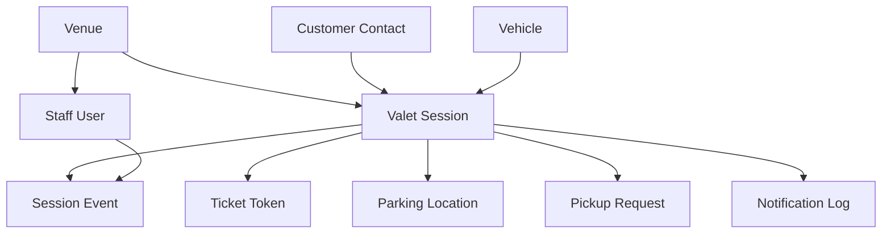

# MVP Data Schema

## Overview

The MVP schema supports one pilot venue, staff users, customer contact records, vehicles, valet sessions, secure ticket tokens, status events, pickup requests, and notification logs.

The schema should stay simple, but every important action should create a durable event so future audit, payments, services, and dispute workflows can build on the same foundation.

## Relationship Summary

## Tables

### venues

Stores pilot venue configuration.

Fields:

- id: primary key
- name: venue display name
- slug: URL-friendly identifier
- address_line_1
- address_line_2
- city
- state
- postal_code
- timezone
- valet_phone
- operating_status
- created_at
- updated_at

### staff_users

Stores staff and manager users.

Fields:

- id: primary key
- venue_id: foreign key to venues
- name
- email
- phone
- role: attendant, runner, manager, admin
- auth_provider_id
- active
- last_login_at
- created_at
- updated_at

### customer_contacts

Stores customer contact details captured at check-in. This is intentionally lighter than a full customer account.

Fields:

- id: primary key
- name
- phone
- email
- preferred_contact_method: sms, email, none
- created_at
- updated_at

### vehicles

Stores vehicle details captured during check-in.

Fields:

- id: primary key
- customer_contact_id: foreign key to customer_contacts
- make
- model
- color
- license_plate
- license_plate_state
- notes
- created_at
- updated_at

### valet_sessions

Stores one active or historical valet visit.

Fields:

- id: primary key
- venue_id: foreign key to venues
- customer_contact_id: foreign key to customer_contacts
- vehicle_id: foreign key to vehicles
- ticket_number
- key_tag
- status
- staff_created_by_id: foreign key to staff_users
- assigned_runner_id: nullable foreign key to staff_users
- checked_in_at
- parked_at
- pickup_requested_at
- ready_at
- completed_at
- cancelled_at
- flagged_at
- flag_reason
- staff_notes
- created_at
- updated_at

Constraints:

- ticket_number should be unique per venue and operating day.
- status must be one of the approved MVP session statuses.

### ticket_tokens

Stores secure public access tokens for customer ticket pages.

Fields:

- id: primary key
- valet_session_id: foreign key to valet_sessions
- token_hash
- last_four_hint
- status: active, revoked, expired
- issued_at
- expires_at
- last_accessed_at
- created_at

Rules:

- Store token hash, not raw token.
- Token must not reveal the internal session ID.
- Revoking a token should not delete session history.

### parking_locations

Stores the latest known parking location or location notes for a valet session.

Fields:

- id: primary key
- valet_session_id: foreign key to valet_sessions
- zone
- floor
- row
- stall
- note
- recorded_by_id: foreign key to staff_users
- recorded_at
- created_at
- updated_at

MVP note:

- Exact GPS is deferred. Use zones and notes first.

### pickup_requests

Stores customer or staff pickup requests.

Fields:

- id: primary key
- valet_session_id: foreign key to valet_sessions
- requested_by_type: customer, staff
- requested_by_staff_id: nullable foreign key to staff_users
- status: requested, assigned, retrieving, ready, completed, cancelled
- assigned_runner_id: nullable foreign key to staff_users
- requested_at
- assigned_at
- retrieving_at
- ready_at
- completed_at
- cancelled_at
- cancel_reason
- delay_reason
- created_at
- updated_at

Rules:

- Only one active pickup request should exist per active valet session.
- Pickup request status should stay consistent with valet session status.

### session_events

Stores the chronological timeline of each valet session.

Fields:

- id: primary key
- valet_session_id: foreign key to valet_sessions
- event_type
- actor_type: customer, staff, system
- actor_staff_id: nullable foreign key to staff_users
- title
- description
- visible_to_customer
- metadata_json
- occurred_at
- created_at

Example event types:

- session_created
- ticket_sent
- status_changed
- parking_location_added
- pickup_requested
- runner_assigned
- retrieval_started
- vehicle_ready
- session_completed
- session_flagged
- notification_failed

### notification_logs

Stores outbound notification attempts.

Fields:

- id: primary key
- valet_session_id: foreign key to valet_sessions
- customer_contact_id: foreign key to customer_contacts
- channel: sms, email
- notification_type: ticket_link, pickup_requested, vehicle_ready
- destination
- status: pending, sent, failed, skipped
- provider
- provider_message_id
- error_message
- sent_at
- created_at

## Status Definitions

### valet_sessions.status

- checked_in
- being_parked
- parked
- pickup_requested
- runner_assigned
- retrieving
- ready
- completed
- cancelled
- flagged

### pickup_requests.status

- requested
- assigned
- retrieving
- ready
- completed
- cancelled

## MVP Reporting Queries

The schema should support:

- Active sessions by status
- Pickup queue ordered by requested_at
- Average pickup wait time from requested_at to ready_at
- Daily completed session count
- Delayed or flagged session list
- Session timeline by ticket number
- Notification failure list

## Future-Compatible Fields

The MVP should leave room for:

- Payment records
- Photo attachments
- Service jobs
- Support cases
- Multi-venue staff assignments
- Customer accounts

Do not add these tables until needed, but avoid schema decisions that would make them hard to introduce.
