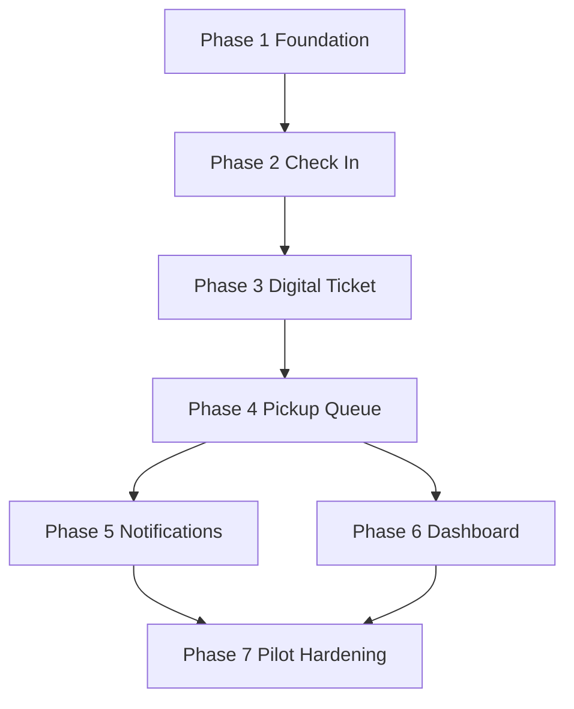

# MVP Implementation Phases

## Overview

The MVP should be built in seven phases. Each phase should leave the product in a more testable state and avoid waiting until the end to validate the valet workflow.

## Phase 1: Foundation

### Objective

Prepare the Nuxt app, routes, database, environment configuration, and shared domain definitions.

### Deliverables

- MVP route structure
- Database connection
- Prisma schema and migrations
- Seed venue
- Seed staff users
- Shared session status constants
- Basic layout for customer, staff, and dashboard views
- Environment variable documentation

### Dependencies

- Technical stack decision
- MVP data schema

### Acceptance Criteria

- App runs locally.
- Database migrations apply cleanly.
- Seed data creates at least one venue and one manager/staff user.
- Staff-only pages are not publicly accessible.
- Shared status values are available to frontend and backend code.

## Phase 2: Valet Check-In

### Objective

Allow staff to create and manage active valet sessions.

### Deliverables

- Staff active sessions page
- New check-in form
- Customer contact capture
- Vehicle capture
- Key tag and ticket number capture or generation
- Valet session creation
- Ticket token generation
- Initial session event creation
- Vehicle detail page

### Dependencies

- Phase 1 foundation

### Acceptance Criteria

- Staff can create a valet session from the browser.
- New session appears in active sessions list.
- Session has a ticket number and secure ticket token.
- Session timeline includes creation event.
- Required fields validate before submission.

## Phase 3: Customer Digital Ticket

### Objective

Give customers a secure mobile ticket experience without requiring an account.

### Deliverables

- Public `/ticket/[token]` route
- Ticket token lookup
- Customer-facing session summary
- Vehicle and venue details
- Current status
- Status timeline
- Pickup request button
- Completed and expired states

### Dependencies

- Phase 2 check-in

### Acceptance Criteria

- Customer can open a ticket link on mobile.
- Invalid or expired token shows a safe error state.
- Customer sees only customer-safe fields.
- Status timeline matches staff updates.
- Pickup button appears only when the session can accept pickup.

## Phase 4: Parking Status and Pickup Queue

### Objective

Complete the operational loop from parked vehicle through pickup request and handoff.

### Deliverables

- Parking location form
- Status update controls
- Customer pickup request endpoint
- Staff pickup queue
- Queue item detail
- Runner assignment
- Retrieving, ready, completed, cancelled, and flagged states
- Pickup wait-time timestamps

### Dependencies

- Phase 3 customer ticket

### Acceptance Criteria

- Staff can mark a vehicle as parked and add location notes.
- Customer can request pickup from the ticket page.
- Pickup request appears in staff queue.
- Staff can move request through retrieving, ready, and completed states.
- Customer ticket reflects pickup state changes.
- Completed session leaves active queue.

## Phase 5: Notifications

### Objective

Send basic customer messages for the most important workflow moments.

### Deliverables

- Notification provider integration
- Ticket link notification
- Pickup request confirmation
- Vehicle ready notification
- Notification log records
- Failure handling and retry guidance
- Staff resend ticket action

### Dependencies

- Phase 2 for ticket link delivery
- Phase 4 for pickup and ready events

### Acceptance Criteria

- Ticket link can be sent to a customer phone number.
- Ready notification is sent when staff marks vehicle ready.
- Notification attempts are logged.
- Failed notifications are visible to staff or manager.
- Local development can run with provider disabled or mocked.

## Phase 6: Venue Operations Dashboard

### Objective

Give managers enough visibility to supervise a pilot shift.

### Deliverables

- Dashboard overview page
- Active sessions by status
- Pickup queue summary
- Daily session count
- Average pickup wait time
- Flagged or delayed sessions
- Basic session search/history

### Dependencies

- Phase 4 pickup queue

### Acceptance Criteria

- Manager can see active operational state at a glance.
- Dashboard metrics update from real session data.
- Manager can open a session from dashboard lists.
- Daily history includes completed sessions.
- Flagged sessions are easy to identify.

## Phase 7: Pilot Hardening

### Objective

Prepare the MVP for simulated shifts and a controlled first venue launch.

### Deliverables

- Empty states
- Error states
- Loading states
- Manual status override rules
- Staff workflow QA pass
- Mobile responsiveness pass
- Basic accessibility pass
- Pilot launch checklist
- Known limitations document

### Dependencies

- Phases 1 through 6

### Acceptance Criteria

- Team can run a full simulated shift from check-in to completed pickup.
- Staff flows work on mobile screens.
- Customer ticket works on mobile web.
- Common errors have understandable messages.
- Managers can identify and resolve a flagged session.
- Known limitations are documented before pilot.

## Build Order Summary

## First Development Milestone

The first internal demo should target:

- Staff creates a session.
- Ticket link opens.
- Staff marks vehicle parked.
- Customer requests pickup.
- Staff marks vehicle ready and completed.

This milestone proves the core loop before notifications and dashboards are polished.
