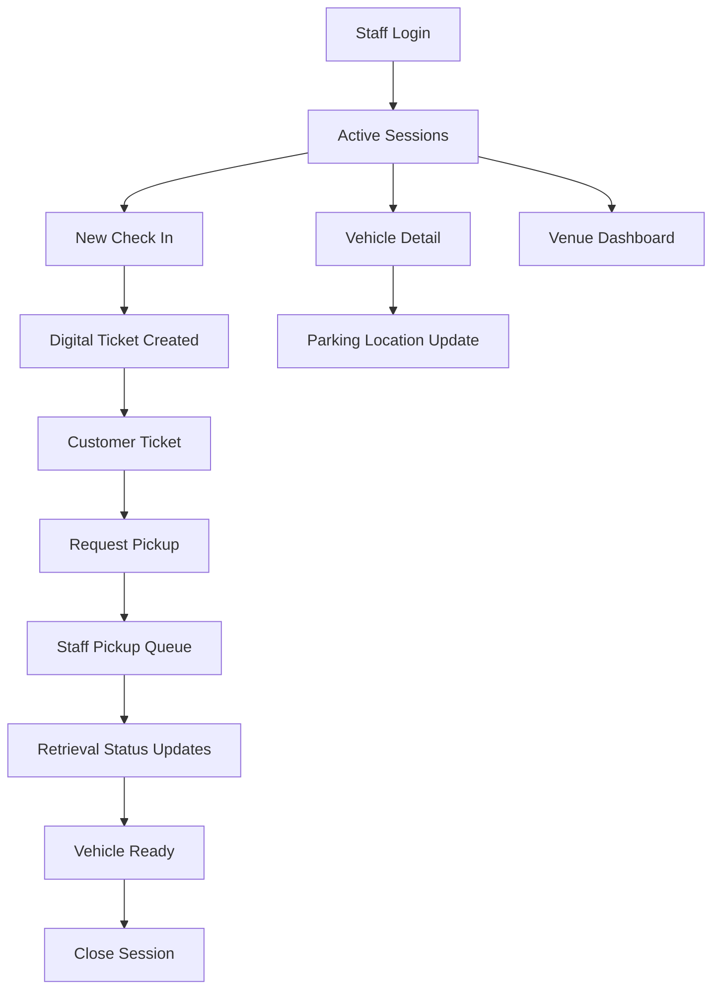

# MVP UX Flows

## Overview

The MVP uses mobile-friendly web surfaces first. Customers use a public digital ticket link. Staff and managers use authenticated web views optimized for phone and tablet screens.

## Flow Map

## Customer Digital Ticket

### Entry Points

- SMS link sent after check-in
- QR code shown by staff
- Manually copied secure ticket link

### Screen: Ticket Overview

Purpose: give the customer confidence that their car is tracked.

Content:

- Crown Valet branding
- Venue name and location
- Ticket number
- Vehicle make, model, color, and plate
- Current status
- Last updated time
- Primary action button

Primary action:

- Request pickup when the vehicle is parked.

Secondary content:

- Status timeline
- Pickup instructions
- Venue contact or valet stand instructions

### Screen: Pickup Requested State

Purpose: confirm the request and reduce repeated calls to staff.

Content:

- Confirmation message
- Request timestamp
- Current pickup status
- Estimated wait time if available
- Instruction to meet at pickup area

Allowed actions:

- View status
- Contact valet stand

### Screen: Vehicle Ready State

Purpose: direct the customer to complete handoff.

Content:

- Vehicle ready message
- Pickup area instructions
- Ticket number
- Vehicle details
- Final status timeline

### Empty and Error States

- Ticket not found
- Ticket expired
- Session already completed
- Pickup request already submitted
- Network error

## Staff Check-In Flow

### Screen: Staff Login

Purpose: restrict operational access to approved staff.

Content:

- Phone or email login
- One-time passcode or simple pilot credential flow
- Venue selection if staff belongs to more than one venue

### Screen: Active Sessions

Purpose: show current operational workload.

Content:

- New check-in button
- Active session count
- Status filters
- Search by ticket, plate, customer, or key tag
- Session cards with vehicle, ticket, status, and last update

### Screen: New Check-In

Purpose: create a valet session quickly at curbside.

Required fields:

- Customer phone number
- Vehicle make
- Vehicle model
- Vehicle color
- License plate
- Key tag

Optional MVP fields:

- Customer name
- Vehicle notes
- Parking zone
- Staff notes

Submission result:

- Ticket number generated
- Secure ticket link generated
- Initial status set to checked_in
- Ticket delivery option shown

### Screen: Vehicle Detail

Purpose: let staff update and review a specific session.

Content:

- Ticket number
- Customer contact
- Vehicle details
- Key tag
- Current status
- Parking location
- Timeline
- Staff notes

Primary actions:

- Update status
- Add parking location
- Send or resend ticket link
- Mark as flagged
- Close session

## Parking Update Flow

### Screen: Parking Location

Purpose: make retrieval faster without requiring exact GPS tracking.

Fields:

- Parking zone
- Floor or level
- Row
- Stall or space
- Freeform note

Status options:

- being_parked
- parked

Completion result:

- Session timeline updates.
- Customer ticket status changes to parked.

## Pickup Queue Flow

### Screen: Pickup Queue

Purpose: coordinate retrieval during active operations.

Content:

- Queue ordered by request time
- Ticket number
- Vehicle details
- Parking location
- Request timestamp
- Current pickup status
- Assigned runner if available
- Delay or flag indicator

Primary actions:

- Assign runner
- Mark retrieving
- Mark ready
- Mark completed
- Flag delay

### Screen: Queue Item Detail

Purpose: give runner enough context to retrieve the car.

Content:

- Vehicle details
- Parking location
- Key tag
- Customer pickup instructions
- Timeline
- Notes

## Venue Dashboard Flow

### Screen: Operations Overview

Purpose: give managers a quick view of current valet health.

Metrics:

- Active vehicles
- Checked in
- Parked
- Pickup requested
- Retrieving
- Ready
- Completed today
- Average pickup wait time

### Screen: Session History

Purpose: support basic review and troubleshooting.

Filters:

- Date
- Status
- Ticket number
- Plate
- Customer phone

Content:

- Session list
- Session details
- Timeline
- Pickup timing

## UX Rules

- Keep check-in fields minimal.
- Put the next operational action at the top of each staff screen.
- Use clear plain-language customer statuses.
- Avoid showing internal staff notes on customer pages.
- Make every status change visible in the timeline.
- Design staff views for outdoor use, one-handed operation, and busy shifts.
