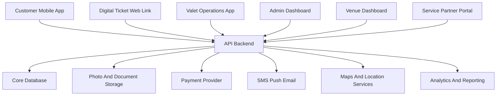
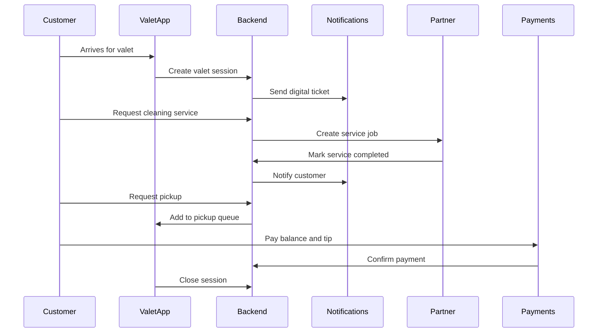

# Architecture

## Overview

Crown Valet should be built as a multi-role platform with mobile customer access, staff operations tools, dashboards, backend services, integrations, and shared data models.

The current repository is a Nuxt 3 landing page. Future product development can either extend this repo into a web platform or split mobile, backend, and dashboard applications into separate packages as the system grows.

## System Context

## Application Surfaces

### Customer Mobile App

Primary customer experience for account management, vehicle profiles, active ticket, tracking, pickup requests, service add-ons, payments, receipts, and support.

### Digital Ticket Web Link

Lightweight web experience for customers who do not install the app. It should support ticket status, pickup request, basic payment, receipt, and support access.

### Valet Operations App

Mobile-first staff tool for check-in, photo capture, key tag assignment, parking location, pickup queue, runner workflow, and incident notes.

### Venue Dashboard

Web dashboard for venue operators to monitor active vehicles, wait times, revenue, service performance, customer issues, and reports.

### Admin Dashboard

Internal platform for Crown Valet administrators to configure venues, roles, pricing, service catalog, refunds, support, reporting, and audit logs.

### Partner Portal

Service partner interface for accepting jobs, updating service status, uploading proof, and reviewing payout reconciliation.

## Backend Services

### Identity and Access

- Customer, staff, manager, admin, venue, and partner identities.
- Role-based access control.
- Venue-scoped permissions.
- Session and token management.

### Valet Session Service

- Ticket creation and lifecycle.
- Vehicle and customer association.
- Status transitions.
- Parking location records.
- Pickup queue and runner assignment.
- Incident hold and session closure.

### Service Marketplace

- Service catalog.
- Service eligibility.
- Job assignment.
- Partner status updates.
- Proof of completion.
- Revenue share metadata.

### Payment Service

- Payment intents and captures.
- Tips and add-ons.
- Refunds and partial refunds.
- Corporate or venue billing.
- Receipt generation.

### Notification Service

- Event-triggered SMS, push, and email.
- Customer preference handling.
- Operational alerts for staff.
- Delivery status tracking.

### Reporting Service

- Operational metrics.
- Revenue reports.
- Partner reports.
- Venue dashboards.
- Exportable summaries.

### Audit Service

- Chronological event log for sessions, payments, support, configuration, and role changes.
- Actor, timestamp, action, and metadata capture.
- Immutable or append-only storage for sensitive events.

## Data Storage

### Relational Database

Recommended for core transactional data:

- Users
- Venues
- Vehicles
- Valet sessions
- Tickets
- Service jobs
- Payments
- Roles
- Audit logs

### Object Storage

Recommended for:

- Vehicle condition photos
- Service proof photos
- Receipts or documents
- Incident attachments

### Analytics Store

Useful when reporting volume grows:

- Aggregated session metrics
- Revenue metrics
- Wait time trends
- Service conversion data

## Integration Points

### Payments

Use a payment provider for card tokenization, payment authorization, captures, refunds, receipts, and settlement reporting.

### Notifications

Use dedicated providers for SMS, push notifications, and email. The system should record delivery attempts and failures.

### Maps and Location

Use maps and geocoding for venue configuration, parking zones, and optional GPS-assisted vehicle location. Exact vehicle location should be role-restricted.

### Partner Services

Partners may initially use the partner portal. Later integrations can support API-based dispatch, fulfillment, and payout reporting.

## Event Flow

## Security Model

- Customers can access only their own sessions and vehicles.
- Valet staff can access sessions for assigned venues and shifts.
- Managers can access operational views for their venues.
- Venue owners can access reporting and configuration for their venues.
- Partners can access only assigned service jobs.
- Platform admins can access support and configuration based on internal permissions.

## Scalability Considerations

- Use event-driven updates for status changes and notifications.
- Keep pickup queue operations fast and reliable.
- Store photos outside the transactional database.
- Cache dashboard aggregates when venue volume increases.
- Design multi-venue configuration from the beginning.

## Suggested Initial Stack Direction

The exact stack should be validated before implementation, but a practical first version could use:

- Nuxt or similar web framework for landing page, dashboard, and digital ticket.
- Docker containers for app runtime, local development, migrations, seeds, and tests.
- Native or cross-platform mobile app for customer and valet operations.
- API backend with relational database.
- Object storage for images.
- Payment, SMS, push, email, and maps providers.

The architecture should remain modular and containerized so the first pilot can launch quickly while leaving room for partner marketplace and multi-venue growth.
