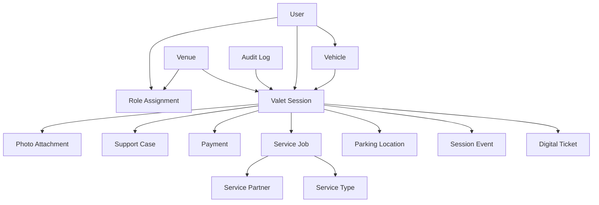

# Data Model

## Overview

This model defines the core entities Crown Valet needs for customer experience, valet operations, service fulfillment, payments, reporting, and auditability. Field names are conceptual and should be refined during implementation.

## Entity Relationship Summary

## Core Entities

### User

Represents customers, valet staff, managers, admins, venue users, and partner users.

Key fields:

- id
- name
- phone
- email
- account status
- notification preferences
- created at
- updated at

### Role Assignment

Defines what a user can do and where.

Key fields:

- id
- user id
- role
- venue id
- partner id
- permissions
- active status
- created at

Example roles:

- customer
- valet_attendant
- valet_runner
- valet_manager
- venue_owner
- partner_user
- support_admin
- platform_admin

### Venue

Represents a hotel, restaurant, event space, residential building, or other operating location.

Key fields:

- id
- name
- address
- timezone
- operating hours
- branding settings
- payment settings
- notification settings
- active status

### Parking Zone

Represents a configured parking area within a venue.

Key fields:

- id
- venue id
- name
- type
- description
- access notes
- active status

### Vehicle

Represents a customer vehicle.

Key fields:

- id
- owner user id
- make
- model
- year
- color
- license plate
- state or region
- photos
- notes

### Valet Session

Represents one vehicle drop-off through final handoff.

Key fields:

- id
- ticket id
- venue id
- customer user id
- vehicle id
- status
- check-in time
- parked time
- pickup requested time
- ready time
- completed time
- assigned attendant id
- assigned runner id
- key tag
- payment status
- incident status
- created at
- updated at

### Digital Ticket

Represents customer-facing ticket access.

Key fields:

- id
- valet session id
- public token
- ticket number
- delivery method
- issued at
- expires at
- access status
- shared access flag

### Parking Location

Represents where a vehicle is parked during a valet session.

Key fields:

- id
- valet session id
- parking zone id
- floor
- row
- stall
- latitude
- longitude
- accuracy
- notes
- recorded by user id
- recorded at

### Session Event

Represents chronological actions during a valet session.

Key fields:

- id
- valet session id
- event type
- actor user id
- actor role
- timestamp
- source
- metadata

Example event types:

- checked_in
- photos_added
- being_parked
- parked
- service_requested
- service_started
- service_completed
- pickup_requested
- runner_assigned
- retrieving
- ready
- payment_completed
- handed_off
- incident_created
- session_closed

### Photo Attachment

Represents condition photos, service proof, support evidence, and receipts.

Key fields:

- id
- valet session id
- service job id
- support case id
- type
- storage URL
- uploaded by user id
- uploaded at
- metadata

### Service Type

Represents a configurable service offering.

Key fields:

- id
- venue id
- name
- category
- description
- base price
- pricing type
- estimated duration
- proof requirements
- eligibility rules
- active status

### Service Job

Represents a requested add-on service for a valet session.

Key fields:

- id
- valet session id
- service type id
- partner id
- status
- requested by user id
- assigned to user id
- price estimate
- final price
- payment status
- requested at
- accepted at
- started at
- completed at
- cancellation reason
- proof status

### Service Partner

Represents a third-party or internal service provider.

Key fields:

- id
- name
- contact details
- supported venues
- supported service types
- operating hours
- payout settings
- SLA targets
- active status

### Payment

Represents customer or venue payment activity.

Key fields:

- id
- valet session id
- service job id
- payer user id
- amount
- currency
- status
- payment provider
- provider reference
- type
- receipt URL
- created at
- completed at

Example payment types:

- valet_fee
- tip
- service_add_on
- refund
- corporate_billing
- venue_billing

### Support Case

Represents support, dispute, refund, or incident handling.

Key fields:

- id
- valet session id
- customer user id
- assigned admin id
- type
- status
- priority
- description
- resolution
- created at
- resolved at

### Audit Log

Represents sensitive platform actions.

Key fields:

- id
- actor user id
- actor role
- venue id
- related entity type
- related entity id
- action
- timestamp
- IP address
- metadata

## Status Enums

### Valet Session Status

- draft
- checked_in
- being_parked
- parked
- service_requested
- service_in_progress
- service_completed
- pickup_requested
- runner_assigned
- retrieving
- ready
- completed
- cancelled
- incident_hold

### Service Job Status

- requested
- pending_payment
- assigned
- accepted
- rejected
- in_progress
- blocked
- completed
- cancelled
- refunded

### Payment Status

- pending
- authorized
- captured
- failed
- refunded
- partially_refunded
- voided

## Data Governance Notes

- Use stable IDs for all core records.
- Keep public ticket tokens separate from internal IDs.
- Store raw photos and documents in object storage, not directly in the database.
- Store payment provider references, not raw card data.
- Retain audit logs longer than operational photos when legally appropriate.
- Restrict exact location fields by role and venue policy.
